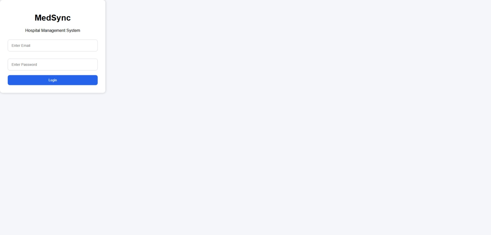
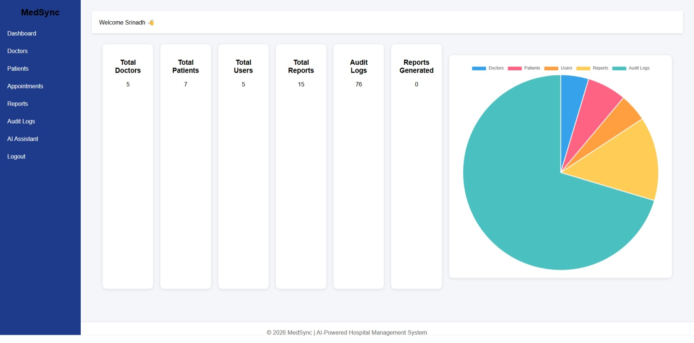
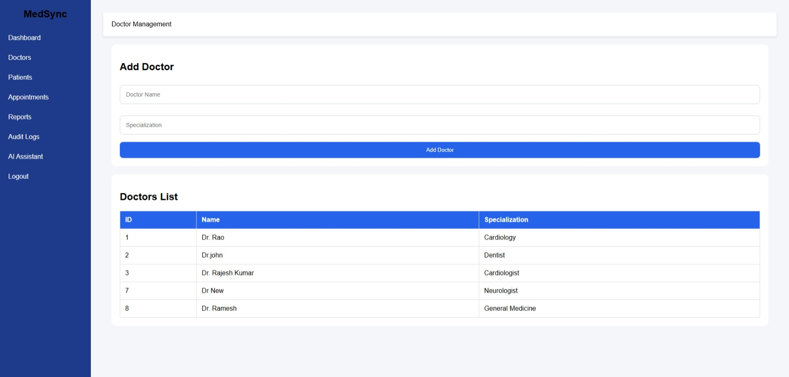
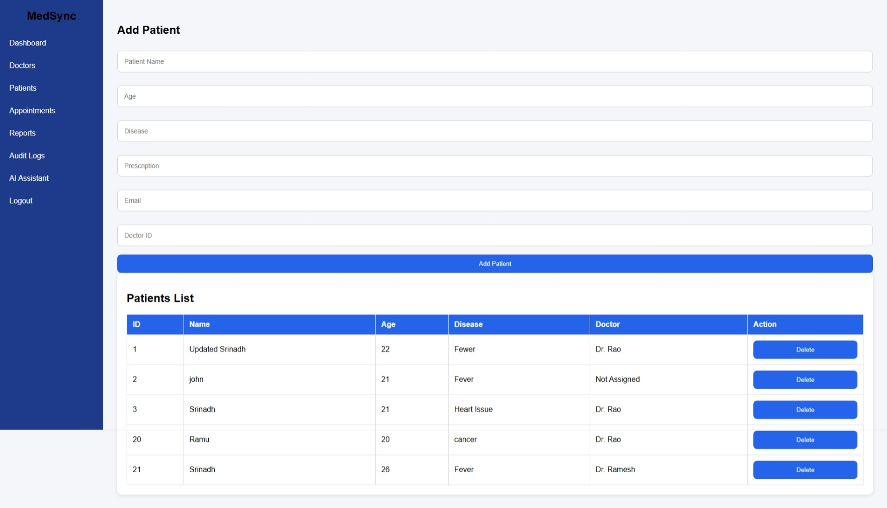
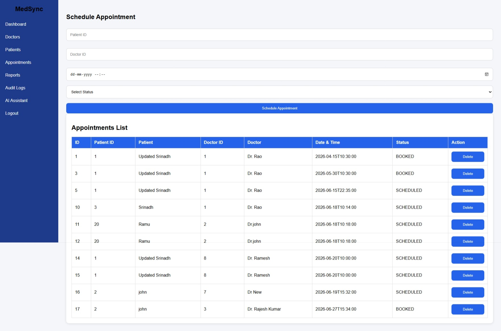
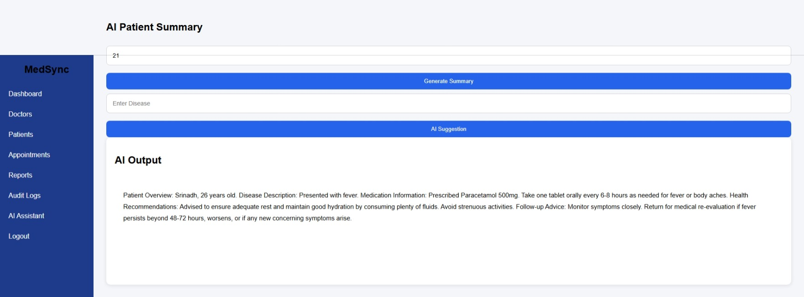
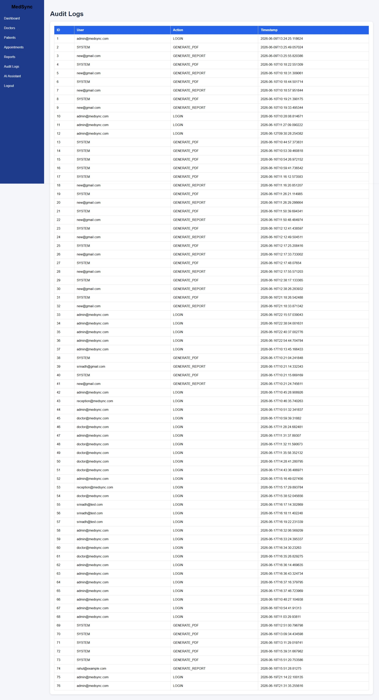

# MedSync – AI-Powered Hospital Management System

## Project Overview

MedSync is a full-stack AI-Powered Hospital Management System designed to streamline healthcare operations through secure patient management, doctor management, appointment scheduling, AI-assisted healthcare recommendations, report generation, and cloud-based document storage.

The system enables hospitals to efficiently manage doctors, patients, appointments, reports, and audit logs while providing secure role-based access control using JWT Authentication. MedSync also integrates Gemini AI to generate patient summaries and healthcare suggestions, improving operational efficiency and healthcare decision support.

---

## Features

### Authentication & Security

* JWT Authentication
* Role-Based Authorization
* Secure Login & Registration
* Spring Security Integration

### Doctor Management

* Add Doctors
* View Doctor Records
* Manage Doctor Information

### Patient Management

* Register Patients
* View Patient Records
* Search Patients
* Maintain Medical History

### Appointment Management

* Schedule Appointments
* Manage Bookings
* View Appointment Details

### Reports & Documentation

* Generate Patient Reports
* Dynamic PDF Generation
* Download Medical Reports
* Report Management

### AI Integration

* AI-Powered Health Suggestions
* AI Patient Summary Generation
* Gemini AI Integration

### Notifications

* Email Report Delivery
* Automated Notifications

### Cloud Storage

* AWS S3 Integration
* Secure Document Storage

### Analytics & Monitoring

* Dashboard Statistics
* Interactive Charts
* Audit Logs
* System Health Monitoring

### DevOps

* Docker Containerization
* Docker Compose Setup
* Environment-Based Configuration

---

## Technology Stack

### Backend

* Java 21
* Spring Boot
* Spring Security
* Spring Data JPA
* JWT Authentication
* Maven

### Database

* MySQL

### Frontend

* HTML5
* CSS3
* JavaScript
* Chart.js

### Cloud & Storage

* AWS S3

### Artificial Intelligence

* Google Gemini AI API

### DevOps

* Docker
* Docker Compose

### Additional Integrations

* PDF Generation (Flying Saucer + Thymeleaf)
* Email Service
* Swagger/OpenAPI Documentation

---

## Key Highlights

* Built a secure Hospital Management System using Spring Boot and JWT Authentication.
* Implemented Doctor, Patient, Appointment, and Report Management modules.
* Integrated Gemini AI for healthcare suggestions and patient summary generation.
* Developed interactive analytics dashboards using Chart.js.
* Generated dynamic PDF medical reports and discharge summaries.
* Integrated AWS S3 for secure cloud storage of reports.
* Implemented email notifications for report delivery.
* Added audit logging for activity tracking and monitoring.
* Containerized the application using Docker and Docker Compose.

---

## Screenshots

### Login Page



### Dashboard Analytics



### Doctor Management



### Patient Management



### Appointment Management



### Report Generation

.jpeg)


### AI Assistant



### Audit Logs



## API Documentation

Swagger UI:

```text
http://localhost:8080/swagger-ui/index.html
```

Available API Modules:

* Authentication APIs
* Doctor Management APIs
* Patient Management APIs
* Appointment APIs
* Report APIs
* AI APIs
* Dashboard APIs
* Audit Log APIs
* Health Check APIs


## Future Enhancements

* Microservices Architecture
* Eureka Discovery Server
* API Gateway
* CI/CD Pipeline
* Kubernetes Deployment
* React Frontend Migration
* Advanced Healthcare Analytics
* Real-Time Notifications

## System Architecture

```text
Frontend (HTML, CSS, JavaScript)
            │
            ▼
Spring Boot Backend
            │
 ┌──────────┼───────────┬───────────┐
 ▼          ▼           ▼           ▼
MySQL     Gemini AI    AWS S3     Email
Database  Integration  Storage    Service

Additional Components:
- JWT Authentication
- Role-Based Authorization
- PDF Generation
- Audit Logging
- Dashboard Analytics
- Docker Containerization
```

## Run Locally

### Clone Repository

```bash
git clone <repository-url>
cd medsync
```

### Run Using Docker

```bash
docker compose up --build
```

Application:

```text
Backend: http://localhost:8080
Swagger: http://localhost:8080/swagger-ui/index.html
```


## Author

Srinadh Bandari
